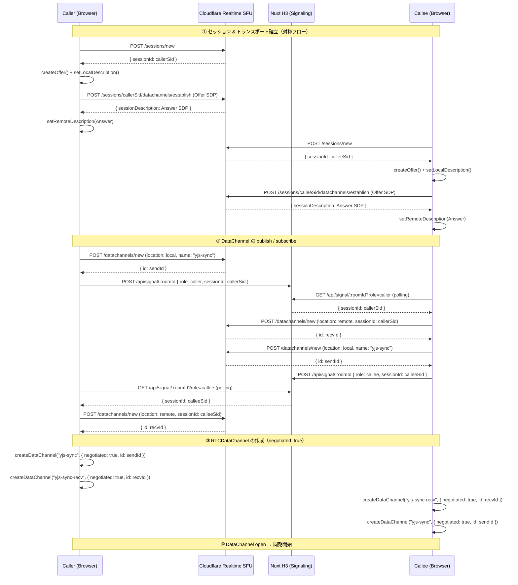
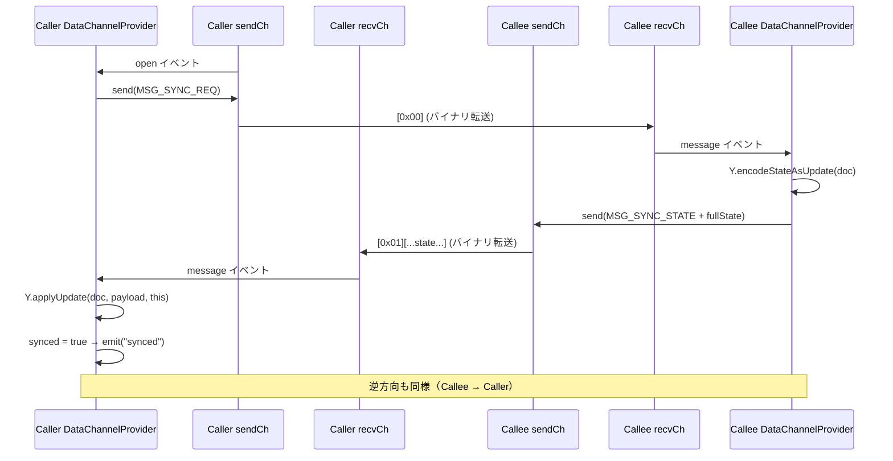
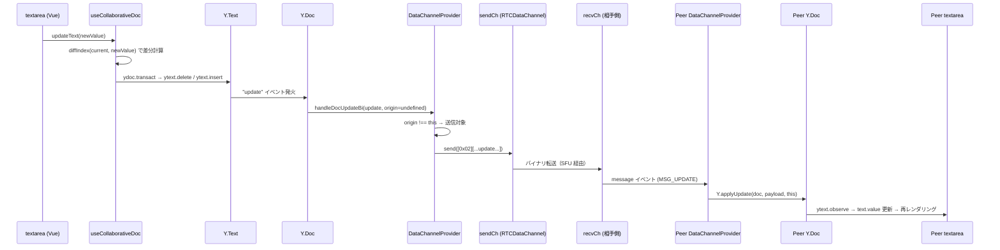
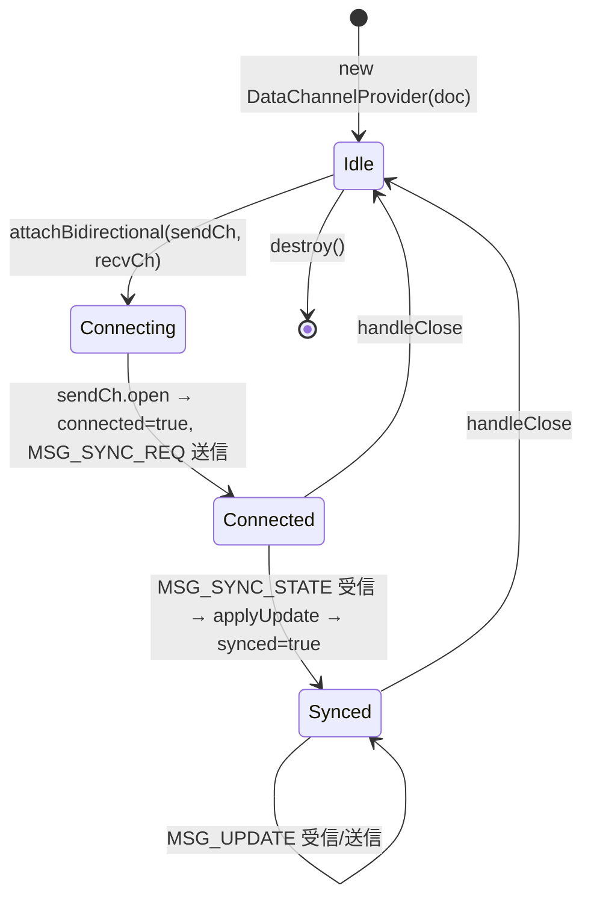

# アーキテクチャ詳細

Cloudflare Realtime SFU の DataChannel をトランスポート層として使用し、Yjs CRDT による二者間リアルタイム共同編集を実現するプロトタイプの設計ドキュメントです。

ADR（アーキテクチャ決定記録）は [docs/adr/](./adr/) を参照してください。

---

## 目次

1. [システム全体構成](#1-システム全体構成)
2. [コンポーネント責務](#2-コンポーネント責務)
3. [データフロー](#3-データフロー)
   - [3-1. 接続確立フロー（Caller / Callee）](#3-1-接続確立フローcaller--callee)
   - [3-2. 初回同期フロー（プル型）](#3-2-初回同期フロープル型)
   - [3-3. インクリメンタル更新フロー](#3-3-インクリメンタル更新フロー)
4. [メッセージプロトコル](#4-メッセージプロトコル)
5. [状態遷移](#5-状態遷移)

---

## 1. システム全体構成

```
┌─────────────────────────────────────────────────────┐
│  Browser (Tab A: Caller)                            │
│  ┌──────────────────────────────────────────────┐   │
│  │ editor.vue                                   │   │
│  │  ├── useCollaborativeDoc  (Yjs + Vue ref)    │   │
│  │  │     └── DataChannelProvider               │   │
│  │  │           └── Y.Doc / Y.Text              │   │
│  │  ├── useCloudflareRealtime (RTCPeerConn)      │   │
│  │  │     ├── sendChannel (publish)             │   │
│  │  │     └── recvChannel (subscribe)           │   │
│  │  └── useSignaling (HTTP polling)             │   │
│  └──────────────────────────────────────────────┘   │
└──────────────────┬──────────────────────────────────┘
                   │ WebRTC DataChannel (SCTP/DTLS)
       ┌───────────┴──────────────┐
       │  Cloudflare Realtime SFU │
       └───────────┬──────────────┘
                   │ WebRTC DataChannel (SCTP/DTLS)
┌──────────────────┴──────────────────────────────────┐
│  Browser (Tab B: Callee)                            │
│  (同一構成)                                          │
└─────────────────────────────────────────────────────┘
       ↕ HTTP ポーリング
┌─────────────────────┐
│  Nuxt H3 Server     │
│  /api/signal/:roomId│
│  (in-memory store)  │
└─────────────────────┘
```

---

## 2. コンポーネント責務

| モジュール                   | ファイル                               | 責務                                                      |
| ---------------------------- | -------------------------------------- | --------------------------------------------------------- |
| `editor.vue`                 | `pages/editor.vue`                     | UI レンダリング、コンポーザブルの組み合わせ               |
| `useCollaborativeDoc`        | `composables/useCollaborativeDoc.ts`   | Y.Doc / Y.Text のライフサイクル管理、Vue ref へのバインド |
| `DataChannelProvider`        | `providers/DataChannelProvider.ts`     | DataChannel ↔ Yjs バイナリブリッジ、同期プロトコル実装    |
| `useCloudflareRealtime`      | `composables/useCloudflareRealtime.ts` | RTCPeerConnection 管理、Cloudflare Calls API 呼び出し     |
| `useSignaling`               | `composables/useSignaling.ts`          | SignalingFns の具体実装（HTTP ポーリング）                |
| `server/api/signal/[roomId]` | `server/api/signal/`                   | sessionId の一時保管（in-memory）                         |
| `types/realtime.ts`          | `types/realtime.ts`                    | 共通型定義                                                |

---

## 3. データフロー

共同編集セッションは以下の 3 フェーズで構成され、**順に実行される**。

```
[3-1] 接続確立
  両者が Cloudflare Realtime SFU に WebRTC セッションを作成し、
  DataChannel を 2 本（sendCh / recvCh）確立する。
  シグナリングサーバー経由で互いの sessionId を交換する。
        ↓ DataChannel が open になったら
[3-2] 初回同期（プル型）
  接続直後に互いの Y.Doc 全体を交換してドキュメント状態を揃える。
  どちらが先に接続されても必ず両側が同じ状態になる。
        ↓ synced = true になったら
[3-3] インクリメンタル更新（常時）
  ユーザーの編集が発生するたびに差分（update）だけを送受信する。
  接続中は継続的に実行される。
```

> **前提**: 3-1 が完了する（`sendCh` / `recvCh` が open になる）まで、3-2・3-3 は開始しない。
> 3-2 の `synced` フラグが立つ前でも 3-3 の `MSG_UPDATE` を受信した場合は適用して `synced = true` とする。

---

### 3-1. 接続確立フロー（Caller / Callee）



流れ：

1. Caller / Callee の両方が独立して `/sessions/new` → `createOffer` → `/datachannels/establish`（Offer SDP 付き）でトランスポートを確立
2. Caller：`sendCh` を publish → シグナリングで sessionId を公開 → Callee の sessionId を取得して `recvCh` を subscribe
3. Callee： Caller の sessionId を取得して `recvCh` を subscribe → `sendCh` を publish → sessionId を公開
4. 両側が `negotiated: true` + API 返却の `id` で `createDataChannel` → open を待って同期開始

ポイント（補足のみ）：

- Caller / Callee の双方が Offer を生成する**対称フロー**のため、`requiresImmediateRenegotiation` の複雑なパスが不要になる
- Callee が先に `sendCh` を publish してから sessionId を公開することで、Caller が subscribe する時物理的にチャンネルが存在する（ordering 保証）

> **3-1 完了後の状態**: 両側の `sendCh` / `recvCh` が open になり、`DataChannelProvider.attachBidirectional(sendCh, recvCh)` が呼ばれた状態。
> `sendCh.open` イベントを受けて自動的に 3-2 が始まる。

### 3-2. 初回同期フロー（プル型）



流れ：

1. `sendCh.open` を検知した側が `MSG_SYNC_REQ`（`0x00`）を送信
2. 受信側は `Y.encodeStateAsUpdate` で自分の全ドキュメント状態をシリアライズし `MSG_SYNC_STATE`（`0x01`）で返信
3. 応答を受け取った側が `Y.applyUpdate` で適用 → `synced = true` に遷移
4. 上記を Caller → Callee と Callee → Caller の両方向で独立に実行

ポイント（補足のみ）：

- `recvCh.open` のタイミングが `sendCh.open` より遅れた場合のリカバリとして、`recvCh.open` 時にも `MSG_SYNC_REQ` を再送する（`applyUpdate` は冪等なので重複適用しても安全）

> **3-2 完了後の状態**: 両側の `synced = true` になり、`doc.on('update')` リスナーが登録済み。
> 以降はユーザーの編集のたびに 3-3 が自動的に実行される。

### 3-3. インクリメンタル更新フロー



流れ：

1. `textarea` の入力時に `diffIndex` で差分箇所を算出し、`Y.Text` の該当箇所のみを `delete` / `insert`
2. `Y.Doc` の `update` イベントが発火 → `DataChannelProvider` が `MSG_UPDATE`（`0x02`）としてバイナリ送信
3. 相手の `recvCh` に届く → `Y.applyUpdate` で `Y.Doc` に適用
4. `ytext.observe` が発火 → `text.value` 更新 → Vue が自動再レンダリング

ポイント（補足のみ）：

- `Y.applyUpdate` に `origin = this` を渡すことで、リモート由来の更新が `update` イベントで再送信される無限ループを防ぐ
- `diffIndex` により全体置換でなく差分のみを CRDT に渡すため、同時編集時の競合解決が正確になる

---

## 4. メッセージプロトコル

DataChannelProvider が `sendCh` / `recvCh` を通じてやり取りするバイナリフレームの仕様。

```
┌──────────┬─────────────────────────────────┐
│  byte[0] │  payload (可変長)                │
│  (type)  │                                 │
└──────────┴─────────────────────────────────┘
```

| type byte | 定数名           | 値  | payload                                | 説明                                  |
| --------- | ---------------- | --- | -------------------------------------- | ------------------------------------- |
| `0x00`    | `MSG_SYNC_REQ`   | 0   | 空 (0 bytes)                           | 相手に現在の完全状態を要求            |
| `0x01`    | `MSG_SYNC_STATE` | 1   | `Y.encodeStateAsUpdate(doc)` の結果    | MSG_SYNC_REQ への応答。フル状態を送信 |
| `0x02`    | `MSG_UPDATE`     | 2   | インクリメンタルな Yjs update バイト列 | ローカル変更の差分を送信              |

### チャンネルの向き

```
Caller.sendCh ──[MSG_SYNC_REQ / MSG_UPDATE]──▶ Callee.recvCh
Caller.recvCh ◀──[MSG_SYNC_STATE / MSG_UPDATE]── Callee.sendCh
```

一本のチャンネルは publish 側 → subscribe 側の**一方向**。双方向同期には 2 本が必要。

---

## 5. 状態遷移

### DataChannelProvider の状態



流れ：

1. `new DataChannelProvider(doc)` → `Idle`
2. `attachBidirectional(sendCh, recvCh)` 呼び出し → `Connecting`（チャンネルはまだ open 前）
3. `sendCh.open` 発火 → `Connected`（`MSG_SYNC_REQ` を自動送信）
4. `MSG_SYNC_STATE` または `MSG_UPDATE` を受信 → `Synced`（編集可能）
5. 切断（`handleClose`） → `Idle` に戻る

ポイント（補足のみ）：

- `Synced` 中は `MSG_UPDATE` の送受信が纚くが、切断されると明示的に再接続操作が必要（転移先は `Connecting` でなく `Idle` → `Connecting` の再呼び出し）
- `destroy()` は Vue の `onUnmounted` フックで呼ばれ、リスナー全解除と `Y.Doc` のメモリ解放まで行う

### RTCPeerConnection の状態（connectionState）

`useCloudflareRealtime` が Vue ref として公開する `connectionState` は `RTCPeerConnectionState` をそのまま反映します。

```
new → connecting → connected → disconnected → closed
                             ↘ failed
```
